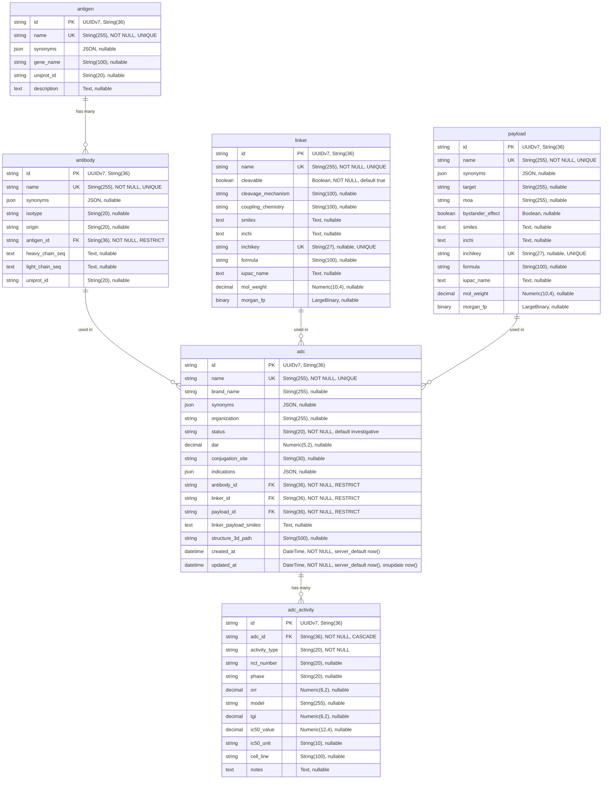

# DB Schema

## ERD



## Table Definitions

### antigen

| Column | Type | Constraints | Description |
|--------|------|-------------|-------------|
| id | String(36) | PK, default `uuid7()` | UUIDv7 primary key |
| name | String(255) | NOT NULL, UNIQUE | Antigen name (e.g., "HER2") |
| synonyms | JSON | nullable | Alternative names (e.g., ["ERBB2", "CD340"]) |
| gene_name | String(100) | nullable | Gene symbol (e.g., "ERBB2") |
| uniprot_id | String(20) | nullable | UniProt accession |
| description | Text | nullable | Free-text description |

**ORM Relationships**:
- `antibodies` -> Antibody[] (back_populates="antigen", lazy="raise")

### antibody

| Column | Type | Constraints | Description |
|--------|------|-------------|-------------|
| id | String(36) | PK, default `uuid7()` | UUIDv7 primary key |
| name | String(255) | NOT NULL, UNIQUE | Antibody name (e.g., "Trastuzumab") |
| synonyms | JSON | nullable | Alternative names |
| isotype | String(20) | nullable | Immunoglobulin class (e.g., "IgG1", "IgG4") |
| origin | String(20) | nullable | chimeric / humanized / human / murine |
| antigen_id | String(36) | NOT NULL, FK -> antigen.id, ON DELETE RESTRICT | Target antigen |
| heavy_chain_seq | Text | nullable | Heavy chain amino acid sequence |
| light_chain_seq | Text | nullable | Light chain amino acid sequence |
| uniprot_id | String(20) | nullable | UniProt accession |

**ORM Relationships**:
- `antigen` -> Antigen (back_populates="antibodies", lazy="raise")
- `adcs` -> ADC[] (back_populates="antibody", lazy="raise")

### linker

| Column | Type | Constraints | Description |
|--------|------|-------------|-------------|
| id | String(36) | PK, default `uuid7()` | UUIDv7 primary key |
| name | String(255) | NOT NULL, UNIQUE | Linker name (e.g., "MC-VC-PABC") |
| cleavable | Boolean | NOT NULL, default true | Cleavable linker flag |
| cleavage_mechanism | String(100) | nullable | protease / acid_labile / disulfide_reduction / photo |
| coupling_chemistry | String(100) | nullable | maleimide / nhs_ester / click / sortase / transglutaminase |
| smiles | Text | nullable | SMILES with `[*:1]` (Ab end) and `[*:2]` (payload end) |
| inchi | Text | nullable | InChI (nullable because attachment points make it invalid) |
| inchikey | String(27) | nullable, UNIQUE | InChIKey (nullable for same reason) |
| formula | String(100) | nullable | Molecular formula |
| iupac_name | Text | nullable | IUPAC name |
| mol_weight | Numeric(10,4) | nullable | Molecular weight in Da (computed via RDKit) |
| morgan_fp | LargeBinary | nullable | Morgan fingerprint, radius=2, nbits=2048, stored as bit string bytes |

**ORM Relationships**:
- `adcs` -> ADC[] (back_populates="linker", lazy="raise")

### payload

| Column | Type | Constraints | Description |
|--------|------|-------------|-------------|
| id | String(36) | PK, default `uuid7()` | UUIDv7 primary key |
| name | String(255) | NOT NULL, UNIQUE | Payload name (e.g., "MMAE") |
| synonyms | JSON | nullable | Alternative names |
| target | String(255) | nullable | Intracellular target (e.g., "Microtubule") |
| moa | String(255) | nullable | Mechanism of action |
| bystander_effect | Boolean | nullable | Can released payload kill neighboring cells? |
| smiles | Text | nullable | SMILES string |
| inchi | Text | nullable | InChI identifier |
| inchikey | String(27) | nullable, UNIQUE | InChIKey (molecular identity) |
| formula | String(100) | nullable | Molecular formula |
| iupac_name | Text | nullable | IUPAC name |
| mol_weight | Numeric(10,4) | nullable | Molecular weight in Da |
| morgan_fp | LargeBinary | nullable | Morgan fingerprint, radius=2, nbits=2048, stored as bit string bytes |

**ORM Relationships**:
- `adcs` -> ADC[] (back_populates="payload", lazy="raise")

### adc

| Column | Type | Constraints | Description |
|--------|------|-------------|-------------|
| id | String(36) | PK, default `uuid7()` | UUIDv7 primary key |
| name | String(255) | NOT NULL, UNIQUE | ADC name (e.g., "Trastuzumab deruxtecan") |
| brand_name | String(255) | nullable | Brand name (e.g., "Enhertu") |
| synonyms | JSON | nullable | Alternative names (e.g., ["T-DXd", "DS-8201"]) |
| organization | String(255) | nullable | Developer/company |
| status | String(20) | NOT NULL, default "investigative" | approved / phase_3 / phase_2 / phase_1 / investigative |
| dar | Numeric(5,2) | nullable | Drug-to-Antibody Ratio (average) |
| conjugation_site | String(30) | nullable | cysteine / lysine / engineered_cysteine / engineered_other |
| indications | JSON | nullable | Disease targets (e.g., ["HER2+ breast cancer"]) |
| antibody_id | String(36) | NOT NULL, FK -> antibody.id, ON DELETE RESTRICT | Antibody component |
| linker_id | String(36) | NOT NULL, FK -> linker.id, ON DELETE RESTRICT | Linker component |
| payload_id | String(36) | NOT NULL, FK -> payload.id, ON DELETE RESTRICT | Payload component |
| linker_payload_smiles | Text | nullable | Pre-connected linker+payload SMILES, `[*:1]` = Ab attachment |
| structure_3d_path | String(500) | nullable | Path to PDB file; NULL = generation failed |
| created_at | DateTime | NOT NULL, server_default now() | Record creation timestamp |
| updated_at | DateTime | NOT NULL, server_default now(), onupdate now() | Last update timestamp |

**ORM Relationships**:
- `antibody` -> Antibody (back_populates="adcs", lazy="raise")
- `linker` -> Linker (back_populates="adcs", lazy="raise")
- `payload` -> Payload (back_populates="adcs", lazy="raise")
- `activities` -> ADCActivity[] (back_populates="adc", lazy="raise", cascade="all, delete-orphan")

**Note**: ADC reaches Antigen transitively via `adc.antibody.antigen`. No direct FK exists.

### adc_activity

| Column | Type | Constraints | Description |
|--------|------|-------------|-------------|
| id | String(36) | PK, default `uuid7()` | UUIDv7 primary key |
| adc_id | String(36) | NOT NULL, FK -> adc.id, ON DELETE CASCADE, indexed | Parent ADC |
| activity_type | String(20) | NOT NULL | clinical_trial / in_vivo / in_vitro |
| nct_number | String(20) | nullable | ClinicalTrials.gov number (for clinical_trial) |
| phase | String(20) | nullable | Trial phase (e.g., "Phase III") |
| orr | Numeric(6,2) | nullable | Objective Response Rate (%) |
| model | String(255) | nullable | Xenograft model (for in_vivo) |
| tgi | Numeric(6,2) | nullable | Tumor Growth Inhibition (%) |
| ic50_value | Numeric(12,4) | nullable | IC50 value (for in_vitro) |
| ic50_unit | String(10) | nullable | IC50 unit (nM, uM, etc.) |
| cell_line | String(100) | nullable | Cell line name (for in_vitro) |
| notes | Text | nullable | Free-text notes |

**ORM Relationships**:
- `adc` -> ADC (back_populates="activities", lazy="raise")

## Relationships Summary

| From | To | Cardinality | FK Column | ON DELETE | Notes |
|------|----|-------------|-----------|-----------|-------|
| antibody | antigen | N:1 | antibody.antigen_id | RESTRICT | One antibody targets one antigen |
| adc | antibody | N:1 | adc.antibody_id | RESTRICT | Many ADCs can use same antibody |
| adc | linker | N:1 | adc.linker_id | RESTRICT | Many ADCs can use same linker |
| adc | payload | N:1 | adc.payload_id | RESTRICT | Many ADCs can carry same payload |
| adc_activity | adc | N:1 | adc_activity.adc_id | CASCADE | Activities deleted with ADC |

**V1 limitation**: Antibody -> Antigen is N:1. Bispecific antibodies cannot be represented. Future extension would require a junction table.

## Index Strategy

| Table | Index Name | Column(s) | Type | Purpose |
|-------|-----------|---------|------|---------|
| antigen | ix_antigen_name_ft | name | FULLTEXT | Text search on antigen names |
| antigen | (auto) | name | UNIQUE (B-tree) | Unique constraint |
| antibody | ix_antibody_name_ft | name | FULLTEXT | Text search on antibody names |
| antibody | (auto) | name | UNIQUE (B-tree) | Unique constraint |
| antibody | (auto) | antigen_id | B-tree | FK join performance |
| linker | ix_linker_name_ft | name | FULLTEXT | Text search on linker names |
| linker | (auto) | name | UNIQUE (B-tree) | Unique constraint |
| linker | (auto) | inchikey | UNIQUE (B-tree) | Molecular identity (nullable) |
| payload | ix_payload_name_ft | name | FULLTEXT | Text search on payload names |
| payload | (auto) | name | UNIQUE (B-tree) | Unique constraint |
| payload | (auto) | inchikey | UNIQUE (B-tree) | Molecular identity (nullable) |
| adc | ix_adc_name_ft | name | FULLTEXT | Text search on ADC names |
| adc | ix_adc_status | status | B-tree | Filter by pipeline stage |
| adc | (auto) | name | UNIQUE (B-tree) | Unique constraint |
| adc | (auto) | antibody_id | B-tree | FK join performance |
| adc | (auto) | linker_id | B-tree | FK join performance |
| adc | (auto) | payload_id | B-tree | FK join performance |
| adc_activity | ix_adc_activity_adc_id | adc_id | B-tree | FK join + activity lookup |

**Notes on FULLTEXT indexes**: Currently created but not used by queries. The search router uses `LIKE '%term%'` which cannot use FULLTEXT indexes. To leverage FULLTEXT, queries would need to use `MATCH(name) AGAINST('term' IN BOOLEAN MODE)`. This is a known gap -- LIKE is sufficient at current dataset scale (~50 ADCs).

**Notes on JSON columns**: `synonyms`, `indications` are JSON columns. MariaDB does not support FULLTEXT indexes on JSON. These are searched via `JSON_SEARCH()` / `JSON_CONTAINS()` when needed (not currently implemented in search endpoints).

## Enum Values (stored as strings, not DB enums)

### ADC Status

| Value | Description |
|-------|-------------|
| approved | FDA/EMA approved |
| phase_3 | Phase III clinical trial |
| phase_2 | Phase II clinical trial |
| phase_1 | Phase I clinical trial |
| investigative | Preclinical/early research |

### Conjugation Site

| Value | Description |
|-------|-------------|
| cysteine | Interchain disulfide cysteines |
| lysine | Surface-exposed lysine residues |
| engineered_cysteine | Site-specific engineered Cys |
| engineered_other | Other engineered sites |

### Activity Type

| Value | Description |
|-------|-------------|
| clinical_trial | Human clinical trial data |
| in_vivo | Animal model data |
| in_vitro | Cell line assay data |

### Antibody Origin

| Value | Description |
|-------|-------------|
| chimeric | Mouse variable + human constant |
| humanized | CDRs grafted onto human framework |
| human | Fully human (transgenic/phage display) |
| murine | Fully mouse-derived |

## Morgan Fingerprint Storage

Morgan fingerprints (radius=2, nbits=2048) are stored as `LargeBinary` columns on `linker` and `payload` tables.

**Storage format**: The fingerprint bit vector is converted to a bit string ("0100110...") and stored as UTF-8 encoded bytes. Total size: 2048 bytes per fingerprint.

**Computation** (in `data/seed.py`):
```python
fp = AllChem.GetMorganFingerprintAsBitVect(mol, radius=2, nBits=2048)
stored = fp.ToBitString().encode()  # bytes
```

**Reconstruction** (in `app/services/chemistry_service.py`):
```python
bit_string = data.decode()
fp = DataStructs.ExplicitBitVect(len(bit_string))
for i, c in enumerate(bit_string):
    if c == "1":
        fp.SetBit(i)
```

**Critical rule**: radius=2, nbits=2048 must match between index time (seed.py) and query time (chemistry_service.py). Mismatched parameters produce meaningless similarity scores.

## Migration History

| Revision | Description | Date |
|----------|-------------|------|
| db45559cbb4e | Initial tables (all 6 tables, indexes, constraints) | 2026-03-23 |

The single migration creates all tables in FK dependency order: antigen, linker, payload -> antibody -> adc -> adc_activity.

## Seed Data Statistics

| Table | Approximate Count | Source |
|-------|-------------------|--------|
| antigen | ~16 | Curated from literature |
| payload | ~10 | ChEMBL + literature |
| linker | ~10 | ChEMBL + literature |
| antibody | ~20 | UniProt + literature |
| adc | ~50 | FDA approvals + clinical trials |
| adc_activity | ~20 | ClinicalTrials.gov + publications |

Insertion order enforced by FK constraints: Antigens -> Payloads -> Linkers -> Antibodies -> ADCs -> Activities.
